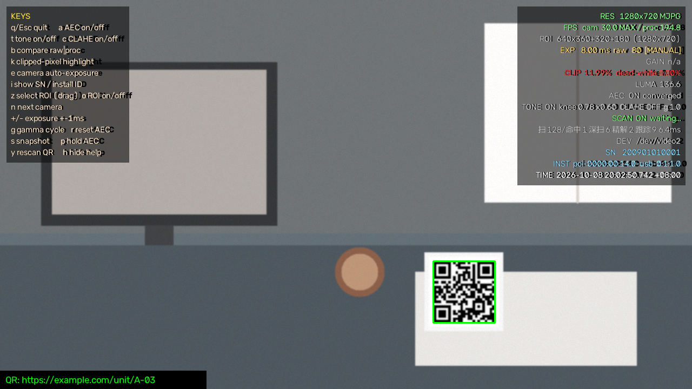
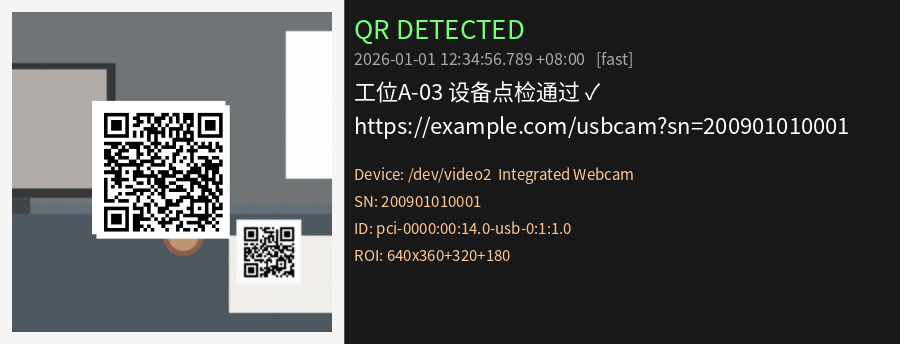

# usbcam-monitor-opencv

> **一个老爷爷辈的神秘摄像头的神秘曝光，帧率优化，如果你选择了此史山项目妄图让你的狗屎相机焕然一新的话，我的建议是换个好点的相机比较好** —— 跑在 Linux/V4L2 上的单命令工具。
> 治过曝、跑满相机帧率、把核心参数常驻画面右上角、扫到二维码自动弹窗。

[](#安装)
[](#安装)
[](requirements.txt)
[](LICENSE)



<sub>*示意图由 `tools/make_screenshots.py` 合成，不含任何真实摄像头内容。*</sub>

**English?** A Linux/V4L2 tool for USB (UVC) cameras: fixes overexposure (manual
exposure + software AEC + highlight roll-off), reports device identity (serial /
physical install ID / resolution / fps / timestamp), probes the camera's true
frame-rate ceiling, crops an ROI to cut per-frame cost, and scans QR/barcodes with
an auto popup. Entry point: `python3 -m usbcam`. Measured numbers in [§3](#3-帧率上限在哪怎么跑满).

---

## 目录

- [特性](#特性)
- [安装](#安装)
- [快速开始](#快速开始)
- [1. 输出：序列号 / 物理安装 ID / 分辨率 / 帧率 / 时间戳](#1-输出序列号--物理安装-id--分辨率--帧率--时间戳)
- [2. 过曝光治理（三层）](#2-过曝光治理三层)
- [3. 帧率：上限在哪、怎么跑满](#3-帧率上限在哪怎么跑满)
- [4. ROI 切割](#4-roi-切割)
- [5. 扫码（默认开启）](#5-扫码默认开启)
- [6. 窗口与快捷键](#6-窗口与快捷键)
- [7. 选对相机（多相机场景）](#7-选对相机多相机场景)
- [8. 命令行参考](#8-命令行参考)
- [9. 项目结构](#9-项目结构)
- [10. 设计取舍与实测数据](#10-设计取舍与实测数据)
- [11. 测试](#11-测试)
- [12. 常见问题](#12-常见问题)
- [License](#license)

---

## 特性

| | 说明 |
|---|---|
| 🔆 **治过曝** | 手动曝光 + 软件自动曝光闭环（高光天花板记忆，单调收敛）+ 高光肩部压缩，三层组合 |
| 📋 **参数输出** | 序列号、物理安装 ID（USB 物理端口路径）、分辨率、帧率、时间戳：控制台 / 窗口右上角 / CSV / JSON 都有 |
| 🎯 **帧率上限探测** | `--fps-probe` 直接回答"能不能突破声明帧率"并给出依据；`--benchmark` 逐个模式实测 |
| ⚡ **不拖慢采集** | 独立抓帧线程 + 后台扫码线程，处理再慢也不掉采集帧（实测主循环上限 21 → 195 fps） |
| ✂️ **ROI 切割** | 鼠标框选 / 参数指定 / 比例记忆；降低每帧计算量，同时让测光与扫码只看感兴趣区域 |
| 🔍 **扫码** | 默认开启，五级策略（多尺度 + 分块 + 预处理 + 候选跟踪），扫到自动弹窗 + 落盘 |
| 🧩 **零硬编码** | 分辨率/帧率/格式/工频全部运行时协商，代码里没有本机标识，换机器直接跑 |
| 🧪 **有测试** | 14 项单元测试 + 假相机端到端 + 17 种退化场景的扫码识别率对比 |

---

## 安装

要求：Linux（V4L2）、Python 3.9+、一个 UVC 摄像头。
建议安装 `v4l2-utils`（提供 `v4l2-ctl`，用于抗闪烁、控件上下限、模式枚举；缺失也能跑）。

```bash
sudo apt install v4l2-utils                    # 建议
pip install -r requirements.txt                # Python 依赖
# 也可以直接用系统包：sudo apt install python3-opencv
```

> `requirements.txt` 用的是 **opencv-contrib-python**：二维码的 `QRCodeDetectorAruco`
> 与一维码的 `barcode` 模块都在 contrib 包里。缺失时程序仍能运行并自动降级，
> 但扫码识别率会下降（启动日志会说明当前用的检测器）。

## 快速开始

```bash
git clone <your-repo-url> && cd usbcam-monitor

python3 -m usbcam                      # 开窗（默认带扫码与过曝治理）
./run_camera.sh                        # 等价入口（无 DISPLAY 时自动转无头）

python3 -m usbcam --list               # 有哪些相机、默认用哪台
python3 -m usbcam --benchmark          # 实测所有模式真实帧率 + ROI 开销
python3 -m usbcam --fps-probe          # 能不能突破相机声明的帧率上限？
python3 -m usbcam --info-only --print-json   # 只读探测，输出 JSON（适合脚本调用）
```

`pip install .` 之后也可以直接用控制台命令：

```bash
usbcam --list
```

---

## 1. 输出：序列号 / 物理安装 ID / 分辨率 / 帧率 / 时间戳

启动时打印设备报告，运行中每 `--status-interval` 秒打印状态行，退出时打印统计；
窗口右上角常驻同样的核心参数。

```text
--------------------------------------------------------------------
USB 相机设备信息 / 采集参数
--------------------------------------------------------------------
  时间戳 Timestamp        : 2026-10-08 19:25:41.209 +08:00
  设备节点 Device Node    : /dev/video2  (OpenCV index 2)
  设备名称 Model          : Integrated Webcam: Integrated W
  序列号 Serial Number    : 200901010001
  物理安装 ID Install ID  : pci-0000:00:14.0-usb-0:1:1.0
  物理端口拓扑 USB Path   : 1-1:1.0
  厂商/产品 ID VID:PID    : 0bda:3031   (Generic / Integrated Webcam)
  驱动 Driver             : uvcvideo   总线: usb-0000:00:14.0-1
  分辨率 Resolution       : 1280x720  (MJPG)
  采集模式 Mode           : MJPG 1280x720@30   (设备声明 30.0 fps)
  帧率 FPS                : 实测 30.1 fps   缓冲 3
  曝光 Exposure           : MANUAL(手动)  31.20 ms (raw 312)
  增益 Gain               : N/A(不支持)
  ROI                     : 640x360+320+180
  扫码                    : 开启 力度=normal 工作宽度 640px, ...
--------------------------------------------------------------------
```

| 字段 | 来源与含义 |
|---|---|
| **序列号** | USB 描述符的 iSerialNumber（sysfs）；设备没写就显示 `N/A (设备未提供序列号)`，再用 `v4l2-ctl --info` 的 Media Serial 和 `by-id` 名称兜底 |
| **物理安装 ID** | 内核 `by-path` 给出的 **USB 物理端口路径**（去掉 `-video-indexN`），如 `pci-0000:00:14.0-usb-0:1:1.0`；取不到时按 sysfs 拓扑现算。它回答"相机插在哪个物理口"，与序列号一起可唯一标识一路安装 |
| **分辨率 / 帧率** | 同时给"请求值"与"实际协商值"；帧率给"设备声明"与"实测"（打开后立刻量 0.6~1 秒） |
| **时间戳** | 每行都带本地时间（毫秒 + 时区） |

窗口右上角（纯 ASCII，见 [§6](#6-窗口与快捷键)）：

```text
RES   1280x720 MJPG
FPS   cam 30.0 MAX / proc 194.8      <- 采集已跑满声明上限 / 主循环处理上限
ROI   640x360+320+180  (640x360)
EXP   8.00 ms  raw 80  [MANUAL]
GAIN  n/a
CLIP  0.42%   dead-white 0.01%       <- 高光溢出像素占比（超标变红）
LUMA  116.6
AEC   ON converged
TONE  ON knee 0.78 x0.60  CLAHE OFF  g 1.0
SCAN  ON waiting...
      扫 128/命中 1 深扫 6 精解 2 跟踪 9 6.4ms
DEV   /dev/video2
SN    200901010001
INST  pci-0000:00:14.0-usb-0:1:1.0
TIME  2026-10-08 20:02:36.974 +08:00
```

---

## 2. 过曝光治理（三层）

### (a) 设备侧

| 动作 | 为什么 |
|---|---|
| 关闭相机自动曝光改手动 | UVC 自动曝光在强光/逆光下会把画面拉爆，并在亮区之间来回跳 |
| `power_line_frequency` = 50/60Hz（按系统时区自动判别） | 消除室内灯光造成的工频条纹与忽明忽暗 |
| 关闭 `exposure_dynamic_framerate` | 防止长曝光时驱动自动降帧，帧率更稳 |
| 增益归零（相机支持且未显式 `--gain`） | 增益是过曝与噪点的放大器，优先用曝光时间 |
| `BUFFERSIZE=3` | 实测 `BUFFERSIZE=1` 会让读操作每帧都等新帧，30fps 掉到 19.6fps |

### (b) 软件自动曝光 AEC（核心）

统计 **高光溢出比例**（灰度 ≥ `--clip-threshold`，默认 250）与 **死白比例**（=255），
结合平均亮度做乘性调节：

* 溢出超过 `--clip-hi`(1.2%) → 降曝光：局部高光用小步 `×0.90`，
  整幅过曝（亮度 >190 或溢出 >30%）才大步快降；
* 偏暗且高光有余量 → 提亮（明显偏暗 `×1.03~1.25`，接近目标 `×1.02~1.08`）；
* **高光天花板记忆**：记住最近一次造成溢出的曝光值，之后提亮最多到它的 92%，
  因此曝光**单调收敛**，不会"降过头 → 提回来 → 再降"地来回震荡；
  只有画面确实偏暗时才每 5 秒释放 5%，场景变化后能重新适应；
* 控制输入取最近 3 帧**中位数**，调整后丢弃 2 帧陈旧画面，避免驱动滞后误判；
* **逆光保护**：整体已偏暗但仍溢出时停止降曝光，并提示"高动态范围场景"。

实测收敛（模拟"20% 面积高光窗"的场景）：

```text
raw 320 -> 128   溢出 20.00% -> 降曝光 x0.40
raw 128 -> 160   偏暗 57.1   -> 升曝光 x1.25
raw 200 -> 216   未达亮度    -> 小幅升曝光 x1.08
收敛: raw=214 (21.4ms) 亮度 95.5 溢出 0.00%，末 3 秒曝光波动 0
```

### (c) 图像侧高光肩部压缩

对 LAB 的 **L 通道**做 256 项 LUT：`knee`(默认 0.78) 以下逐值不变，
以上按 `g(u) = u - A·u·(1-u)` 压缩，数学上保证：

* 单调递增（不会色调反转）；
* `g(u) ≤ u`，纯白 255 仍映射 255 —— **只会压暗高光，绝不会把接近 255 的像素顶到 255**；
* knee 附近 5 点平滑，无硬折点。

> ⚠️ **诚实说明**：已经到 255 的死白像素信息已丢失，任何曲线都救不回来。
> 实测（真实画面人为过曝）：×1.2 时溢出 0.64% → 0.56%；×3.2 时 37.28% → 36.94%（几乎无改善）。
> 真正解决过曝靠 (a)(b) 把曝光降下来，(c) 只把"濒临溢出"的高光压回可用范围。
> CLAHE（`--clahe`）只提暗部，默认关闭以免放大噪声。

---

## 3. 帧率：上限在哪、怎么跑满

### 3.1 先看硬事实：很多相机的 30fps 是固件写死的

`lsusb -v` 读相机自己的 UVC 描述符（最权威依据）。本机测的这台（0bda:3031）：
**10 个帧描述符全部 `bFrameIntervalType=1`（离散、只有一个值）
`dwFrameInterval=333333µs` = 30fps**，从 160x120 到 1280x720 都一样；
另一台（05c8:0445）也只有 333333 / 666666（30 / 15fps）。

```console
$ python3 -m usbcam --fps-probe
当前模式: MJPG 1280x720@30（声明 30 fps）
     请求fps        驱动接受       实测fps   结论
        30        30.0        30.0   跑满声明上限
        60        30.0        30.0   跑满声明上限     <- 请求 60 被夹回 30
        90        30.0        30.0   跑满声明上限
       120        30.0        29.7   跑满声明上限

结论: 请求再高也被夹回 30 fps。原因在相机固件：UVC 描述符里每个帧描述符
      只给出一个 dwFrameInterval（=1/帧率），主机无法请求更短间隔，
      因此这是硬件上限，软件（含 ROI 裁剪）无法突破。
```

**换成支持 60fps 的相机会自动吃到红利**：`auto` 策略优先选设备支持的最高帧率档
（本机 YUYV 1280x720 只有 10fps、640x480 有 30fps，程序会自动避开 10fps 那个坑）。

### 3.2 跑满上限：抓帧线程 + 后台扫码

既然上限是相机给的，那至少不能因为**处理慢**而掉下来。项目做了三件事：

1. **独立抓帧线程**：`read()` 与处理解耦，处理再慢也不让采集等它；
2. **非阻塞相机控制**：改曝光等操作投递给抓帧线程执行（V4L2 单线程化），
   主循环不再为一次回读等一个帧周期；
3. **后台扫码线程**：扫码每帧要 5~30ms，搬到后台后不占显示帧时间。

实测对比（1280x720 整幅、扫码开启、10 秒）：

| 配置 | 采集帧率 | 主循环实际 | 主循环处理上限 |
|---|---|---|---|
| 早期版本（同步扫码 + 同步回读曝光） | 30.0 | 21.8 | 21.0 fps |
| 同步扫码（`--qr-sync`） | 29.9 | 22.2 | 46.4 fps |
| **默认（抓帧线程 + 后台扫码）** | **29.9** | **29.5** | **194.8 fps** |

HUD 上的 `FPS cam 30.0 MAX / proc 194.8 drop 0` 就是这三个数：
**MAX** = 已跑满设备声明上限，`drop` = 主循环没接住的帧数。

---

## 4. ROI 切割

```bash
python3 -m usbcam --roi 320,180,640,360     # 像素坐标 x,y,w,h
python3 -m usbcam --roi "25,25,50,50%"      # 相对比例（换分辨率也适用）
python3 -m usbcam --no-roi                  # 整幅处理
```

窗口里按 **`z`** 鼠标拖拽框选，按 **`o`** 在"整幅 / ROI"间临时切换；
框选结果按**相对比例**记忆到 `~/.config/usb_cam_monitor/config.json`，重启沿用。

ROI 带来三件事（`--benchmark` 可复现）：

| 处理区域 | 像素 | 统计 | 增强 | 主循环合计 | 显示上限 |
|---|---|---|---|---|---|
| 整幅 1280x720 | 921600 | 1.47ms | 2.20ms | 3.66ms | 273 fps |
| ROI 640x360 | 230400 | 0.82ms | 1.17ms | 1.99ms | 503 fps |
| ROI 320x180 | 57600 | 0.08ms | 0.58ms | 0.66ms | 1512 fps |

1. **处理上限成倍提升**（上表），延迟同步下降；
2. **扫码更清楚**：扫码工作宽度是绝对值（默认 640px），ROI 越小降采样越少，
   码在检测器眼里越大；320 宽的 ROI 甚至按原分辨率直扫；
3. **测光/增强只看该区域**：背景过曝、背景二维码不再干扰判断。

程序还会尝试把 ROI 通过 V4L2 selection 下发给相机做**硬件裁剪**（UVC 1.5 ROI）；
多数 UVC 相机不支持，此时会打印"相机拒绝了裁剪请求，使用软件 ROI"并继续。

---

## 5. 扫码（默认开启）

扫到码后自动完成四件事：

1. **控制台**打印完整内容（UTF-8，中文正常）+ 时间戳 + 序列号 / 物理安装 ID；
2. **弹窗 `QR Result`**：左：二维码裁剪图；右：内容、时间、设备与 ROI 信息；
3. **落盘**：`scans/*.png` + `scans/scans.jsonl`（node / serial / install_id / 分辨率 / ROI / 命中级别）；
4. **主窗口**画出定位框与提示条。



### 5.1 五级识别策略

| 级别 | 时机 | 作用 |
|---|---|---|
| 1 | 每 2 帧 | `QRCodeDetectorAruco` @640px（实测最快） |
| 2 | 同上 | 经典 `QRCodeDetector` 兜底（两者互补） |
| 3 | 命中四边形 | 裁出来做原分辨率 + 2× 放大精解 |
| 4 | 上次没解出 | 记住该区域，后续 8 帧持续精解（对焦/抖动时特别有效） |
| 5 | 每 0.5s 轮转一级 | 加强梯子：1.5× / 2× / CLAHE+锐化 / 2×2 分块 / 分块+增强 |
| 一维码 | 每 4 次 | `BarcodeDetector`，成本 ~0.9ms |

加强梯子**每次只跑一级**（轮转），单帧开销可控（5~30ms，且运行在后台线程），
一个完整轮转覆盖所有组合。

### 5.2 实测识别率

`tests/test_qr_robustness.py` 用 17 种真实退化场景（透视、模糊、运动模糊、低对比、
暗光、过曝、噪声、JPEG 质量 20、旋转 12°/25°、小目标、角落、贴纸遮挡）评估：

| 策略 | 识别率 |
|---|---|
| 早期：单次 480px 检测 | 15/17 (88%) |
| **默认 normal** | **16/17 (94%)** |
| `--qr-effort deep` | 16/17 (94%) |

唯一仍失败的是"二维码只占画面 **5%**"（1280 宽下 64px，33 模块 ≈ 2 像素/模块，
接近奈奎斯特极限）——这种请用 ROI 把码框大。

### 5.3 参数

```bash
python3 -m usbcam --no-qr                  # 关闭扫码
python3 -m usbcam --qr-effort deep         # 更用力（多尺度+分块+预处理）
python3 -m usbcam --qr-scan-width 960      # 更远/更小的码
python3 -m usbcam --qr-interval 1          # 每帧都扫（后台线程，不影响帧率）
python3 -m usbcam --qr-sync                # 改回主循环同步扫
python3 -m usbcam --qr-cooldown 30         # 同内容 30s 内只提示一次
python3 -m usbcam --qr-popup off           # 只打印不弹窗
python3 -m usbcam --qr-no-barcode          # 只扫二维码
python3 -m usbcam --qr-open-url            # 扫到 http(s) 链接自动开浏览器（默认关）
```

---

## 6. 窗口与快捷键

窗口名固定 ASCII：**`USB Camera Monitor`** / **`QR Result`**，
**窗口内所有文字也都是 ASCII** —— OpenCV 的 Hershey 字体无法渲染中文
（中文窗口名在部分 OpenCV/X11 环境下会直接导致窗口打不开）。
中文只出现在：控制台、日志、以及用 PIL 渲染的扫码弹窗里。

| 键 | 作用 |
|---|---|
| `q` / `Esc` | 退出（框选态下先取消框选） |
| `a` | 软件自动曝光 AEC 开关 |
| `t` / `c` | 高光肩部压缩 / CLAHE 开关 |
| `b` | 原始 vs 处理后 左右对比 |
| `k` | 溢出像素高亮（洋红染色，直观看到哪里还在过曝） |
| `e` | 切换相机自带自动曝光 |
| `i` | 显示/隐藏 SN 与物理安装 ID |
| `z` | 鼠标拖拽框选 ROI（`Esc` 取消） |
| `o` | 临时切换 整幅 / ROI |
| `n` | 切换到下一个相机（会重新扫描设备，选择被记住） |
| `+` / `-` | 曝光 ±1ms（手动，同时关闭 AEC） |
| `g` / `r` | 伽马循环 / 重置 AEC 重新收敛 |
| `y` | 清除扫码去重记录，立即重新扫 |
| `s` | 保存原始图 + 处理图快照 |
| `p` | 暂停自动曝光调整（画面继续实时显示） |
| `h` | 帮助面板开关 |

---

## 7. 选对相机（多相机场景）

`auto`（默认）的顺序：**记住的相机 → 唯一设备 → 终端询问 → 非交互回退第一个**。
匹配按 `序列号 → 物理安装 ID → 节点名`，换 USB 口、重启、节点号变化都能认回。

```bash
python3 -m usbcam --list                                   # 设备 / 支持模式 / 当前默认
python3 -m usbcam --device /dev/video2                     # 按节点
python3 -m usbcam --device 2                               # 按 OpenCV 索引
python3 -m usbcam --device serial:200901010001             # 按序列号（最稳）
python3 -m usbcam --device name:Integrated                 # 按型号名（子串）
python3 -m usbcam --device install:usb-0:1:1.0             # 按物理安装 ID（子串）
python3 -m usbcam --set-default --device serial:XXXX        # 记住它
python3 -m usbcam --forget                                 # 清除记忆（相机 + ROI）
```

运行中按 `n` 切换相机；记住的相机没插好时会打印
`[警告] 记住的默认相机当前不在线：SN=… 安装ID=…`，然后才回退。

---

## 8. 命令行参考

<details>
<summary><b>设备</b></summary>

| 参数 | 默认 | 说明 |
|---|---|---|
| `--device` | `auto` | `auto` / 索引 / `/dev/videoN` / `serial:` / `name:` / `install:` |
| `--list` | — | 列出采集设备与支持模式 |
| `--set-default` / `--forget` | — | 记住某台为默认 / 清除记忆 |
| `--info-only` | — | 只读探测，不改相机设置 |
| `--no-ask` / `--no-save-choice` | — | 不询问 / 不记住本次选择 |

</details>

<details>
<summary><b>采集模式（默认全部自动协商）</b></summary>

| 参数 | 默认 | 说明 |
|---|---|---|
| `--size` | `auto` | `auto` 或 `WxH` |
| `--fps` | `auto` | 帧率上限，取不超过它且声明最高的模式 |
| `--fourcc` | `auto` | `auto` / `MJPG` / `YUYV` |
| `--max-pixels` | 1280×720 | auto 选模式时的画面像素上限 |
| `--buffers` | 3 | V4L2 缓冲数（设 1 会掉一半帧率） |
| `--no-probe` | — | 不做实测帧率校验 |
| `--benchmark` / `--benchmark-seconds` | — / 0.6 | 实测所有模式帧率 + ROI 开销 |
| `--fps-probe` | — | 请求 15/30/60/90/120fps 实测能否突破 |
| `--no-thread` | — | 关闭独立抓帧线程 |

</details>

<details>
<summary><b>ROI</b></summary>

| 参数 | 默认 | 说明 |
|---|---|---|
| `--roi` | 记忆值 | `x,y,w,h` 或 `x,y,w,h%` |
| `--no-roi` | — | 整幅处理 |
| `--no-hw-crop` | — | 不下发相机硬件裁剪 |

</details>

<details>
<summary><b>曝光与画质</b></summary>

| 参数 | 默认 | 说明 |
|---|---|---|
| `--exposure-ms` / `--exposure-min-ms` / `--exposure-max-ms` | 沿用当前 / — / 一帧周期 | 曝光时间 |
| `--gain` | 相机支持则归零 | 增益 |
| `--keep-device-auto-exposure` | 关 | 保留相机自动曝光 |
| `--no-aec` | — | 关闭软件 AEC |
| `--target-clip` / `--clip-hi` | 0.5 / 1.2 (%) | 溢出比例目标区间 |
| `--target-luma` / `--dark-luma` | 115 / 75 | 目标平均亮度 / 低于它才提亮 |
| `--tone-knee` / `--tone-strength` / `--no-tone` | 0.78 / 0.6 / — | 高光肩部压缩 |
| `--gamma` / `--clahe` | 1.0 / 关 | 伽马 / 暗部提升 |
| `--power-line` | `auto` | `auto` / `off` / `50` / `60` |

</details>

<details>
<summary><b>扫码</b></summary>

| 参数 | 默认 | 说明 |
|---|---|---|
| `--no-qr` | — | 关闭扫码 |
| `--qr-effort` | `normal` | `fast` / `normal` / `deep` |
| `--qr-scan-width` | 640 | 检测所用降采样宽度 |
| `--qr-interval` | 2 | 每 N 帧扫一次 |
| `--qr-cooldown` | 8.0 | 同内容重复提示间隔（秒） |
| `--qr-popup` / `--qr-popup-seconds` | `on` / 8.0 | 弹窗开关 / 自动关闭秒数 |
| `--qr-no-barcode` | — | 只扫二维码 |
| `--qr-sync` | — | 主循环同步扫（默认后台线程） |
| `--qr-dir` / `--font` / `--qr-open-url` | `scans` / 自动查找 / 关 | 落盘目录 / 弹窗字体 / 扫到链接自动打开 |

</details>

<details>
<summary><b>界面与输出</b></summary>

| 参数 | 默认 | 说明 |
|---|---|---|
| `--window-scale` | 1.0 | 显示缩放 |
| `--no-gui` | — | 无头运行 |
| `--duration` | 0 | 运行秒数，0 = 直到按 q |
| `--status-interval` | 5.0 | 状态行间隔 |
| `--log-csv` / `--print-json` | — | 输出 CSV / JSON |
| `--save-frame` | — | 启动约 2 秒后导出带叠加层的画面 |
| `--snapshot-dir` | `snapshots` | 按 `s` 保存快照的目录 |
| `--no-v4l2ctl` | — | 纯 OpenCV，不调用 `v4l2-ctl` |
| `--keep-settings` | — | 退出时保留优化设置（默认恢复原状） |

</details>

---

## 9. 项目结构

```
usbcam/                 # 主包（职责单一，逐个模块可单独测试）
├── __init__.py         # 版本与包说明
├── __main__.py         # python3 -m usbcam 入口
├── config.py           # 配置记忆：默认相机 / ROI（XDG 路径，纯 JSON）
├── util.py             # 时间戳、ASCII 过滤、中文字体查找、折行、窗口名常量
├── v4l2.py             # v4l2-ctl 封装：模式枚举解析、控件读写、硬件裁剪尝试
├── devices.py          # 设备发现 / 元数据（序列号·物理安装 ID·拓扑）/ 选择策略
├── capture.py          # 采集：模式协商、实测帧率、曝光读写、帧率上限探测、抓帧线程
├── roi.py              # ROI：解析、裁剪、鼠标框选、比例记忆、硬件裁剪下发
├── stats.py            # 帧统计：平均亮度、高光溢出、死白、分位数
├── exposure.py         # 软件自动曝光 AEC（高光天花板记忆，单调收敛）
├── enhance.py          # 高光肩部压缩 LUT / CLAHE / 溢出高亮 / 对比视图
├── qr.py               # 扫码：五级策略 + 后台线程 + 弹窗合成（PIL 渲染中文）+ 落盘
├── overlay.py          # 窗口叠加层（纯 ASCII）与帮助面板
├── report.py           # 控制台报告 / 状态行 / CSV / JSON
├── cli.py              # 命令行参数（按功能分组）
├── benchmark.py        # 模式实测 / 帧率上限探测 / ROI 管线基准
└── app.py              # 主循环装配

tests/
├── test_units.py               # 14 项单元测试（不需要相机）
├── test_end_to_end_fakecam.py  # 假相机端到端：扫码 → 弹窗 → 落盘
└── test_qr_robustness.py       # 17 种退化场景的扫码识别率对比

tools/make_screenshots.py       # 生成 README 里的示意图
docs/                           # 示意图
usb_cam_overexposure.py         # 兼容入口（等价于 python3 -m usbcam）
run_camera.sh                   # 启动脚本（无 DISPLAY 自动转无头）
```

数据流：

```
设备/V4L2 ──► capture.Camera ──► FrameGrabber(线程) ──► 主循环
                                        │                 ├─ roi.apply        裁剪
                                        │                 ├─ stats.analyse    测光
                                        │                 ├─ exposure.AEC     调曝光
                                        │                 ├─ enhance.apply    高光压缩
                                        │                 └─ qr.AsyncScanner(线程) 扫码
                                        └─ 相机控制（曝光/增益/抗闪烁）在本线程执行
                                                          │
                          窗口 HUD(overlay) ◄────────────┘──► 控制台/CSV/JSON(report)
```

---

## 10. 设计取舍与实测数据

* **不写死任何设备参数**：分辨率/帧率/格式/工频全部运行时协商，代码里没有本机标识
  （可自查：`grep -rn "video[0-9]\|pci-0000" usbcam/` 结果为空）。
* **为什么必须用 contrib 版 OpenCV**：`QRCodeDetectorAruco` 无码约 5ms，
  经典 `QRCodeDetector` 同分辨率更慢；`barcode` 模块用于一维码。
  两者都不在标准包里，缺失时自动降级。
* **为什么扫码不每帧做**：1280×720 单次全分辨率解码约 30ms，会把帧率压垮；
  改为"每 2 帧在 640px 上扫 + 命中后原分辨率精解 + 后台线程"。
* **为什么不追求"突破 30fps"**：那是相机固件限制（见 [§3.1](#31-先看硬事实很多相机的-30fps-是固件写死的)）。
  软件能做的是**跑满上限**并留出处理余量，本项目把主循环上限从 21fps 提到约 195fps。
* **为什么窗口文字必须 ASCII**：OpenCV 的 Hershey 字体没有中文字形，
  写中文会显示成方框/乱码；中文窗口名在部分 X11 环境下会直接创建失败。
  需要显示中文（二维码内容）时用 PIL 渲染成图片贴在弹窗里。

---

## 11. 测试

```bash
python3 tests/test_units.py                  # 14 项单元测试（无需相机）
python3 -m pytest tests/ -q                  # 也可以用 pytest
python3 tests/test_end_to_end_fakecam.py     # 假相机端到端：扫码 → 弹窗 → 落盘
python3 tests/test_qr_robustness.py          # 17 种退化场景识别率（含新旧策略对比）
python3 tools/make_screenshots.py            # 重新生成 README 示意图
```

覆盖范围：模式解析与选择策略、ROI 解析/裁剪/比例记忆、色调 LUT 性质
（单调、不提亮、255→255）、AEC 收敛与上下限/逆光保护、帧统计、扫码识别与去重、
无码不误报、配置读写、ASCII 过滤与折行、端到端链路。

CI 建议：`pytest tests/test_units.py tests/test_end_to_end_fakecam.py`（都不需要真实相机）。

---

## 12. 常见问题

| 现象 | 处理 |
|---|---|
| 选成了电脑内置摄像头 | `--list` 看清节点，`--device serial:XXX` 指定后 `--set-default`；运行中也可按 `n` |
| 提示"记住的默认相机当前不在线" | 相机没插好或被占用：重新插拔后 `--list` 确认 |
| `--benchmark` 看着像卡住 | 它在逐个模式实测（有进度输出）；`--benchmark-seconds 0.3` 可加速，`Ctrl+C` 会保留已测结果 |
| 想突破帧率上限 | 先 `--fps-probe`：若请求 60 被夹回 30，说明相机固件只有 30fps，软件无法突破；换支持 60fps 的相机会被自动识别 |
| 主循环跟不上（`drop` 不为 0） | 框 ROI 降低每帧计算量，或 `--qr-effort fast`、调小 `--qr-scan-width` |
| 扫码识别不到 | 看 HUD 的 `扫N/命中M 深扫X` 是否在涨；再提高 `--qr-scan-width`、`--qr-effort deep`、把 ROI 框到码上 |
| 一直"已达最大曝光仍偏暗" | 补光，或 `--exposure-max-ms` 放宽（可能掉帧），或降低 `--fps` |
| 一直"已达最小曝光仍过曝" | 环境光过强：加 ND 减光片、降低光源，或提高 `--clip-hi` |
| 画面发灰 | `--tone-strength` 调小 / `--tone-knee` 调大，或 `--no-tone` |
| 硬件裁剪提示"相机拒绝" | 该 UVC 相机不支持 UVC ROI，属正常，已自动用软件 ROI |
| 窗口打不开 | 检查 `echo $DISPLAY`；程序会自动转无头模式并提示 |
| 设备被占用 | `fuser -v /dev/videoN` 查看占用进程 |

---

## License

[MIT](LICENSE)。


